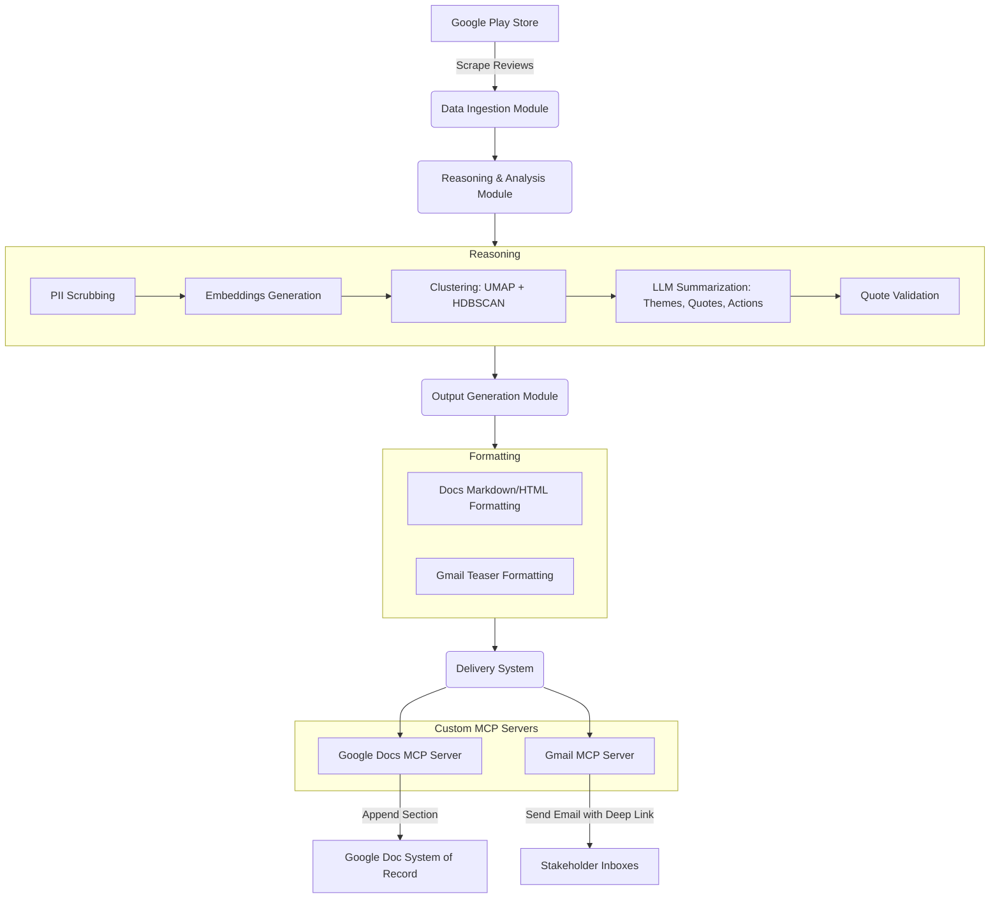

# Architecture: Automated Weekly App Review Pulse

This document outlines the architecture for the Automated Weekly App Review Pulse system for the **Groww** application. The system ingests public reviews from the Google Play Store, clusters and analyzes the feedback using embeddings and LLMs, and securely delivers the insights to stakeholders via custom-built Google Workspace MCP servers.

---

## 1. High-Level System Workflow

The architecture is divided into four primary modules:
1. **Data Ingestion**: Scrapes recent reviews from the Google Play Store.
2. **Reasoning & Analysis**: Processes text, clusters reviews, and uses an LLM to generate insights.
3. **Output Generation**: Formats the insights into a structured report and an email teaser.
4. **Human-Visible Delivery (MCP)**: Safely interfaces with Google Docs and Gmail via dedicated Model Context Protocol (MCP) servers.

---

## 2. Component Details

### 2.1 Data Ingestion Module
- **Source**: Google Play Store only.
- **Mechanism**: Scraper-based extraction targeting the Groww app.
- **Data Window**: Retrieves reviews from the last 8–12 weeks (configurable).
- **Output**: A stripped-down, normalized dataset of reviews keeping only `Rating` and `Text` (metadata like User ID and Date are explicitly removed to reduce noise).

### 2.2 Reasoning & Analysis Module
This module is the core analytical engine.
- **PII Scrubbing (Local)**: Sanitizes review text locally (e.g., via Presidio/Regex) to remove personally identifiable information and conserve API token limits.
- **Embeddings & Clustering (Local)**: Converts text to vector embeddings using a local, lightweight HuggingFace model, and uses density-based clustering (e.g., UMAP + HDBSCAN) to group similar feedback.
- **LLM Processing (Groq API)**: Analyzes clusters using the `llama-3.3-70b-versatile` model to:
  - Name overarching themes.
  - Extract representative, verbatim quotes.
  - Propose actionable ideas.
  *Note:* Strict token counting, rate-limiting (30 RPM), and centroid-based sampling are enforced to ensure requests stay within Groq's 12K TPM limits.
- **Quote Validation**: A strict verification step that ensures quotes returned by the LLM exist verbatim in the original review data, avoiding hallucination.

### 2.3 Output Generation Module
Formats the LLM's output into the final presentation layers:
- **Report Template**: Structures the full narrative (Top themes, Real user quotes, Action ideas) for the Google Doc.
- **Email Template**: Creates a lightweight teaser summarizing the top themes as bullet points, accompanied by a deep link to the newly created section in the Google Doc.

### 2.4 Human-Visible Delivery (MCP Servers)
To isolate the agent from Google Workspace credentials, delivery is handled entirely via dedicated MCP servers deployed on Railway (`https://google-mcp-server-production-27c2.up.railway.app`).
- **Google Docs MCP**:
  - Handles authentication and OAuth.
  - Appends the weekly report as a new, clearly labeled (and dated) section to the running canonical Google Doc (*Weekly Review Pulse — Groww*).
- **Gmail MCP**:
  - Drafts and sends a short email to predefined stakeholder mailing lists.
  - Includes a deep link directly to the new heading created by the Docs MCP.

---

## 3. Orchestration and Execution

- **Scheduler**: The system is designed to run via a scheduled job (e.g., cron job every Monday morning IST).
- **CLI Interface**: Includes a command-line interface allowing manual backfills for any specified ISO week.
- **Idempotency**:
  - *Google Docs*: Enforced via a stable section anchor. If the system runs twice for the same ISO week, it will update the existing section rather than creating a duplicate.
  - *Gmail*: Run-scoped idempotency checks prevent duplicate emails from being sent for the same reporting period.
- **Auditability**: The orchestration layer logs delivery identifiers (Document Heading IDs, Message IDs) and metadata to guarantee a clear trail of "what was sent, when, and for which week."

---

## 4. Security and Privacy

- **Data Safety**: Reviews are treated strictly as data, never as instructions (preventing prompt injection). Cost and token limits are enforced per run.
- **Credential Management**: Google OAuth secrets and credentials are **not** stored in the agent codebase. They are strictly managed and contained within the configuration of the custom MCP servers.
- **Draft Mode**: Development and staging environments default to creating email drafts rather than sending them, requiring explicit confirmation before delivery.
